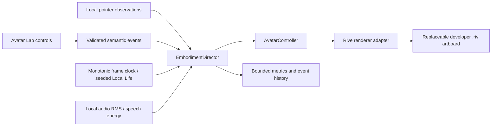

# AMYU architecture

Status: foundation and Avatar Lab only. This document describes the current boundary and the intended later boundaries; a directory is not an implemented feature.

AMYU is the product and runtime. The personal companion name belongs to a future editable `CompanionProfile`. No renderer or core package assumes that the character is named AMYU.

## Current execution path

React presents controls and snapshots. Pure TypeScript owns state arbitration, local life, interpolation, gaze, gestures, and speech energy. The renderer owns the translation into the artwork's state machine or exposed properties. No model is involved in this path.

`apps/avatar-lab` runs the lab in a browser. `apps/desktop` mounts the same shared lab inside a Tauri 2 webview. This milestone uses a normal development window, not the future transparent pet window. Rust exposes one metadata-only diagnostics command; it has no OS automation, capture, filesystem, microphone, camera, or connector operations.

## Package ownership

| Boundary | Responsibility | Current scope |
| --- | --- | --- |
| `avatar-contract` | Semantic states, emotions, gestures, gaze and controller | Implemented |
| `protocol` | Validated domain events and typed event bus | Implemented |
| `embodiment` | Deterministic director, local life and interpolation | Implemented |
| `avatar-rive` | Rive-specific asset binding and lifecycle | Implemented temporary artwork adapter |
| `audio` | RMS and attack/release lip sync boundary | Local lab driver |
| `observability` | Bounded frame, event and latency measurements | Lab metrics |
| `shared-ui` | Bilingual Avatar Lab presentation | Implemented |
| `user-profile` | Editable explicit user and companion identities | Types only |
| `companion-core` | Identity, relationship, personality and coordination | Reserved contract |
| `conversation` | Normalized realtime provider lifecycle | Reserved contract |
| `vision` | Approved capture and normalized inspection | Reserved contract |
| `memory` | Inspectable, correctable durable memory | Reserved contract |
| `skills` | Versioned permission-aware work instructions | Reserved contract |
| `capabilities` | Device operations and a single action gateway | Reserved contract |
| `permissions` | Policy outside model prompts | Reserved contract |
| `connectors` | Scoped external accounts | Reserved contract |
| `providers/*`, `apps/api`, `skills/*`, `evals/*` | Future adapters, infrastructure and evaluation suites | Explicit placeholders |

## Dependency rules

1. Providers depend on normalized core/protocol contracts. Core never imports an SDK.
2. Conversation code emits semantic intent. Only the Rive adapter knows Rive property names.
3. Local life is deterministic for a seed and clock. It runs without a network session.
4. Platform code stays in Rust/platform adapters. Core never imports Windows capture APIs.
5. Future executable actions must flow through a capability gateway and permission engine. A prompt cannot authorize an OS action.
6. Explicit profiles override inferred preferences. Conversation-derived memory cannot silently change configuration.
7. Secrets belong in a later native/backend vault. No secret or provider credential is needed by this milestone.

## Desktop evolution

The future pet window is small, transparent, frameless and primarily character. A separate companion panel manages conversation, memory, skills, tasks, connections and permissions. Click-through regions, focus safety, drag persistence, tray behavior and multi-monitor placement require a later Windows desktop acceptance pass. The lab does not claim these properties.

## Current limitations

The temporary asset validates the runtime boundary and can be replaced. It is not the original production character. Automated tests validate pure state behavior; visual quality, native webview behavior and a 30-minute human acceptance session remain separate gates. See [roadmap](roadmap.md), [Rive specification](rive-character-spec.md), and [manual acceptance](../tests/manual-acceptance.md).
